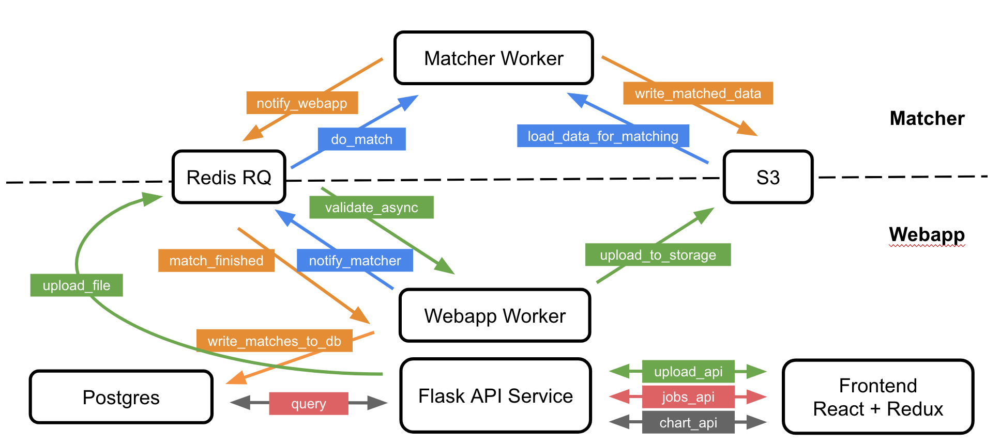

# Modifying the Webapp

The webapp can be modified for adding new APIs, plots or functionalities that will improve the usability as well as the analysis. This document introduce the tech stacks and design patterns in the matching tool. The web application of this matching tool follows one of the popular and productive tech stacks today, a combination of [React](https://reactjs.org/)/[Redux](https://github.com/reduxjs/react-redux) for creating UI and consuming APIs as the frontend, [Python/Flask](http://flask.pocoo.org/) for providing APIs as the backend, and [SQLAlchemy](https://www.sqlalchemy.org/) as the Python Object Relation Map (ORM) to communicate with the [PostgreSQL](https://www.postgresql.org/) database. The architecture is shown in the diagram.



- [PostgreSQL](https://www.postgresql.org/): An open source object-relational database.
- [alembic](http://alembic.zzzcomputing.com/en/latest/): A database migrations tool written by the author of [SQLAlchemy](https://www.sqlalchemy.org/).

## Applying Changes

Before we get into the deep dive, here's a reference on applying webapp changes to a running version of the matching tool.

- If you make changes to Python code, the code itself will automatically make it to each needed container through the mounted volume designated in the docker-compose file. However, the containers have to apply the changes. The webapp container will do this automatically, as Flask is running in development mode. However, if you are changing asynchronous code that runs in the worker container (like validation code), you will have to restart the `webapp_worker` container. If you're not sure which type of code you are modifying, restart the container to be safe.
- If you make changes to Javascript code, you have to recompile the JS file by running a command in the webapp container: `docker exec webapp -c 'cd frontend && npm run build'`. In addition, you may have to [force-refresh your browser](https://refreshyourcache.com/en/cache/) to ensure all of the new code is applied to your browser, at least until [this issue](https://github.com/dssg/matching-tool/issues/255) is fixed. 

## Backend

The backend of the matching tool follows the general modern Flask patterns with some variations, and uses the Flask [Blueprints](http://flask.pocoo.org/docs/1.0/blueprints/) for better modularization of APIs. A blueprint can be seen as a collection of APIs and can be registered to the application. The template html files go to the `/templates` and all the static files go to the `/static`, including css files, icon, and the Javascript bundle.

```
backend
├── __init__.py
├── app.py
├── apis
    ├── __init__.py
    ├── chart.py
    ├── jobs.py
    ├── upload.py
    └── query.py
├── templates
    ├── _base.html
    └── index.html
├── static
    ├── output.js
    ├── main.css
    ⋮
    └── favicon.ico
├── models.py
├── database.py
├── tasks.py
⋮
└── validations
    └── __init__.py
```

1. Tech stacks
    - [Flask](http://flask.pocoo.org/): A python microservice framework. Simple restish APIs that talk json with the client side app.
    - [goodtables](https://github.com/frictionlessdata/goodtables-py): A framework to validate tabular data.
    - [RQ](http://python-rq.org/): A simple Python library for queueing jobs and processing them in the background with workers which uses [Redis](https://github.com/andymccurdy/redis-py) as a backend. RQ (or something similar) is necessarily because webapp-triggered processes (validation, matching) can take longer than is viable to do synchronously.
    - [SQLAlchemy](https://www.sqlalchemy.org/): A SQL toolkit and Object Relational Mapper that gives application developers the full power and flexibility of SQL.
    - [Pandas](https://pandas.pydata.org/): A Python data analysis library.

2. Details

    - **APIs**: One can modify APIs in `matching-tool/webapp/backend/apis`  Currently, the backend factors the application into 3 sets of blueprint and a `query.py` module:
            - `query.py`: A module provides python functions as interface for querying data from postgres, which use [pandas](https://pandas.pydata.org/) intensely for data manipulation.
            - `chart.py`: Charts related APIs, which provide the information consumed by frontend dashboard.
            - `jobs.py`: Async-jobs related APIs, which use [rq](http://python-rq.org/) for getting information of jobs.
            - `upload.py`: Upload related APIs, which contains functionalities of async uploading and validation.


    - **Validation**: If one wants to change the validation rules for the data schemas, `matching-tool/webapp/backend/validation` is where to modify the codes. This module uses certain functionalities from [goodtables](https://github.com/frictionlessdata/goodtables.io), a python library that implements validation of tabular data according to a given schema and customizable list of checks.

    - **ORM**: The backend uses [SQLAlchemy](http://www.sqlalchemy.org/) as the Object Relational Mapper which presents a method of associating user-defined Python classes with database tables, and instances of those classes (objects) with rows in their corresponding tables. The database tables are defined in `database.py`

    - **output.js**: It's the Javascript bundle file generated by `Webpack`.

3. Test Suite

A [variety of unit tests are written for the backend](https://github.com/dssg/matching-tool/tree/master/webapp/backend/tests) and generally run using `py.test`. These can most easily be run using [tox](https://tox.readthedocs.io/en/latest/): `tox -e py36`.

The backend has good test coverage, and it is good practice to modify these tests to match any new functionality. The [endpoint tests](https://github.com/dssg/matching-tool/blob/master/webapp/backend/tests/test_endpoints.py) are especially good at finding regression bugs as they simulate the interaction between the frontend client (javascript) and the backend. The other tests are smaller-scale, more on a unit test level.


## Frontend

The frontend of the matching tool is basically implemented with React/Redux patterns and stuctured in a variation of Rails Style known as **module index**. We're organizing the sourcecode content by its type. `actions`, `constants`, `reducers`, and `components` all have dedicated files, but notice that `actions`, `constants` and `reducers` each also have a similarly-named `index.js` file. Noted that the details of React/Redux are not covered here, one should check out the official documentations.

```
frontend
├── actions
    └── index.js
├── components
    ├── app.js
    ├── appbar.js
    ├── timeline.js
    ├── venn.js
    ⋮
    └── upload.js
├── constants
    └── index.js
├── index.js
├── reducers
    └── index.js
⋮
├── store
    └── configureStore.js
└── webpack.config.js
```

1. Tech stacks
    - [Webpack](https://webpack.js.org/): A module bundler which takes all module dependencies and generates static assets that represent them.
    - [React](https://reactjs.org/): A Javascript library for building user interface.
    - [Redux](https://redux.js.org/): Redux is a predictable state container for JavaScript apps.
    - [Ramda](https://ramdajs.com/): A Javascript library for functional programming.
    - [Material-UI](https://v0.material-ui.com/#/): React components that implement Google's Material Design.
    - [react-vis](https://uber.github.io/react-vis/): A collection of react components to render common data visualization charts.
    - [venn.js](https://github.com/benfred/venn.js/): A javascript library for laying out area proportional venn and euler diagrams.

2. Details
    - **React components**: One can modify frontend React components in `matching-tool/webapp/frontend/components`. React lets you define components as classes or functions which split the UI into independent, reusable pieces, and think about each piece in isolation.
    - **Actions**: In Redux, [Actions](https://redux.js.org/basics/actions) are payloads of information that send data from your application to your store which can be found the codes in `matching-tool/webapp/frontend/actions`
    - **Reducers**: In Redux, [Reducers](https://redux.js.org/basics/reducers) specify how the application's state changes in response to actions sent to the store which can be found in `matching-tool/webapp/frontend/reducers`
    - **webpack.config.js**: The config tells webpack where to find the Javascript and React files, and where to put the generated Javascript bundle.

3. Test Suite

There are a minimal amount of unit tests written for the Javascript frontend, using [Jest](https://jestjs.io/). The coverage is not very good, but that is something we are looking to improve. Similarly to the backend tests, these can also be run using Tox: `tox -e js`, although [NodeJS](https://nodejs.org/en/) needs to be installed first.

This repository has acceptance tests written using Nightwatch, which comes bundled in our JS developer dependencies so you don't need to install it separately. However, requires a locally running Selenium server and the Chrome driver. Later we will add other browsers to this setup.

- [Download the Selenium standalone server](http://www.seleniumhq.org/download/)
- [Download the ChromeDriver](https://sites.google.com/a/chromium.org/chromedriver/downloads)

To make the ChromeDriver executable work with our nightwatch config, it needs to be available in your PATH.

The Selenium server is packaged as a JAR file, so you can run it as any other JAR file: `java -jar <path/to/selenium/jar/file>`

The acceptance tests rely on some test users and jurisdictions in the webapp's database. This is covered in the setup at the top of this README, so make sure that is completed before trying to run these tests.

You can run the tests by navigating to the `webapp/frontend` directory and running `npm run acceptance`. If all goes well, you should see many instances of Chrome pop up, a bunch of text entry, clicking and page loading, and all tests passing in your console.
