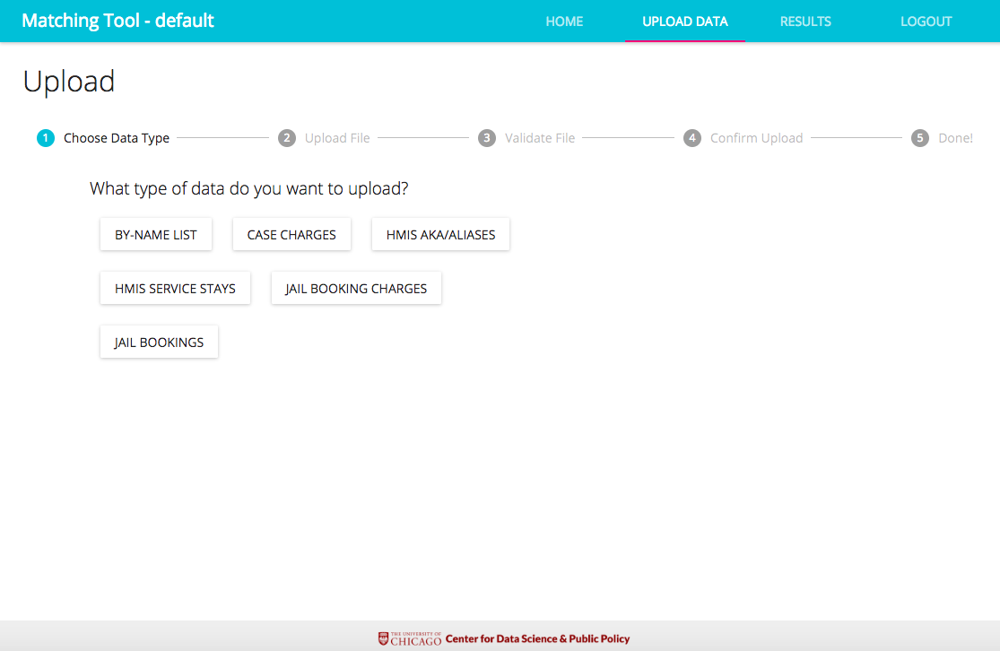

Matching Tool User Documentation

August 2018

# Table of Contents
## [Introduction](#introduction) 
## [Login Page](#login-page)	
## [Home Page](#home-page)	
## [Uploading Data](#uploading-data)
#### [Step 1: Select Upload Data](#step-1-select-upload-data-1)	
#### [Step 2: Choose Data Type](#step-2-choose-data-type)	
### Step 3: Upload File	
### Step 4: Validate File	
### Step 5: Confirm Upload and Return to Home Page	
## Results Page	
### Data Fields	
### Control Panel
### Duration Charts
## Downloading Results
## Logout

# Introduction

The Matching Tool is a web-based platform that assists communities in matching Homeless Management Information System (HMIS) and criminal justice records in order to identify people who are cycling through both systems and prioritize them for supportive housing. The tool is fed tabular data, which is securely stored and matched with data from other systems within the same jurisdiction. The tool then displays results from the matched data to find overlaps between the populations and frequent utilizers of both systems. 

# Login Page

This is the first page of the tool. Accessing the tool requires a registered email address and password combination. This must be entered and submitted in the form on the Login page, as seen in Figure 1. After entering the details, click "Login" to be directed to the Home Page. 

**Figure 1: Login Page**

# Home Page

The first page that a user will see after logging in is the Home page of the Web based tool that explains the two major steps of the tool process, which are **Upload** and **Results**. On the right of the Home page is a column that provides a list of successful and unsuccessful tasks (no errors while uploading tabular data) that have been processed or are currently being processed by the matching tool. This ticker on the right of the Home web page provides the status and duration times for the matching, validation and uploading of each file. 

**Figure 2: Matching Tool Home Page**

# Uploading Data

In order to upload data onto the matching tool, the following steps must be carried out. 

## Step 1: Select Upload Data

On the Home page, the user will be directed to the uploading page after selecting **Upload** from the Home page, as seen in Figure 2. Here, you will be able to able to upload the data you would like to have matched with data from other systems.

**Figure 3: Uploading Data**

## Step 2: Choose Data Type 

After selecting Upload from the Home page, the user will then be taken to the Upload Data Main Page (shown in Figure 3). The user then chooses the type of data that needs to be uploaded. The options are "HMIS Service Stays", “Jail Bookings”, “Jail Booking Charges”, “HMIS AKA/Aliases”, “Case Charges” or “By-name list” as seen in Figure 4. 

**Figure 4: Upload Data Main Page**

## Step 3: Upload File 

Allows you to browse computer files for upload. File needs to be tabular (CSV is preferred) and represent user data from an existing county system. This data will be stored securely and matched with existing data from other county systems 

**Figure 5: Select and Upload File**

## Step 4: Validate File 

The matching tool checks that the required fields and formats of the uploaded file satisfies the necessary requirements. 

**Failed Uploads:** The most common error encountered with the tool would be because of an unknown delimiter used in the file. Only commas (,) or pipes (|) are permitted. You can also download the report in a CSV format by clicking "Download Full Error Report". Figure 5 gives an example of a common upload failing.

**Figure 6: Failed Upload - Unknown Delimiter**

If instead you encounter a System error as seen in Figure 7, please contact your system administrator.  

**Figure 7: Failed Upload - System Error**

**Successful Uploads:** If the data is validated successfully, then the screen will present the first 10 rows of the uploaded data  and the total number of rows found. After reviewing the first 10 rows, the user has the option to confirm or cancel the upload. Figure 8 gives an example of an upload confirmation.

**Figure 8: Successful Upload**

## Step 5: Confirm Upload and Return to Home Page

After you have confirmed your upload, the next screen will show the number of total unique rows  and the total number of rows that had not been uploaded before. You can then go back to the home page and see your data being processed on the ticker. 

**Figure 9: Final Upload Confirmation**

# Results Page

The Results page provides a summary of the results based on the data uploaded and matched from the County’s jail bookings and HMIS stays. 

Each of the data fields can be clicked on to sort the data based on the field specified in either ascending or descending order. The Results page also provides the total number of records, the number of jail booking records, the number of HMIS stay records, and the number of records and  percent of HMIS and Jail booking records found in both datasets. The tool also provides the data field information by clicking on the question mark icon at the top of the page (under Upload Data).

**Figure 10: Results Page Overview**

## Data Fields

* matched_id: The id for this person generated by the matching algorithm

* first_name: The most recent first name in the data

* last_name: The most recent last name in the data

* booking_id: The jail database’s ID number for the person

* jail_contact: The number of contacts (bookings) with the jail in the last year

* last_jail_contact: The most recent jail booking date as of the data transfer

* cumu_jail_days: The total number of days in jail for all jail stays that had any days in the last year

* hmis_id: The homeless database’s ID number for the person

* hmis_contact: The number of contacts with homeless services in the last year

* last_hmis_contact: The most recent start date of homeless service contact as of the data transfer

* cumu_hmis_days: The total number of days in homeless services for all homeless service stays that had any days in the last year

* total_contact: The total number of contacts with jail and homeless services in the last year

## Control Panel

The control panel in the results page allows you to query data by specifying start & end dates. The default end date is the date in which the file was uploaded. 

Under the button that toggles between the viewing of duration charts and the list of results, there are Venn diagrams providing information on the division of all data between the two data types. While looking at the list of results, areas in the Venn diagram can also be selected to filter the results being displayed on the page. In order to revert back to displaying data results for all records, one can simply select "All" right above the Venn diagrams. In the Venn diagram, the left circle will contain the most records out of the two datasets and will update according the control panel criteria selected by the user.

**Figure 11: Control Panel Options: Venn Diagram Selection**

## Duration Charts

Instead of viewing a list of results from the data that was matched, the tool also allows you to view duration charts for number of days spent in a shelter as well as number of contacts with homeless services.

**Figure 12: Duration Charts for Length of Booking/Stay and Number of Contacts**

# Downloading Results

The list of results queried can also be downloaded as a CSV file by clicking the "Download List of Results" button at the bottom of the Control Panel. This can also be done for duration charts when “Show Duration Chart” is selected.  Selecting the updated “Download Duration Charts” button will download the charts in a PNG file.

**Figure 13: Downloading Duration Charts or List of Results**

The original source data with matched ids can be downloaded as well by scrolling to the bottom of the Control Panel. 

**Figure 14: Downloading original source data from event**

* On clicking "Event Type" a dropdown menu pops up with the different event options. On selecting the desired event, the source data for that event can be downloaded by clicking “Download Source Events”. 

**Figure 15: Selecting Event Type using dropdown menu**

# Logout

Logs you out of the tool
